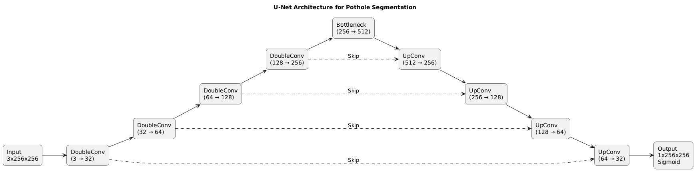
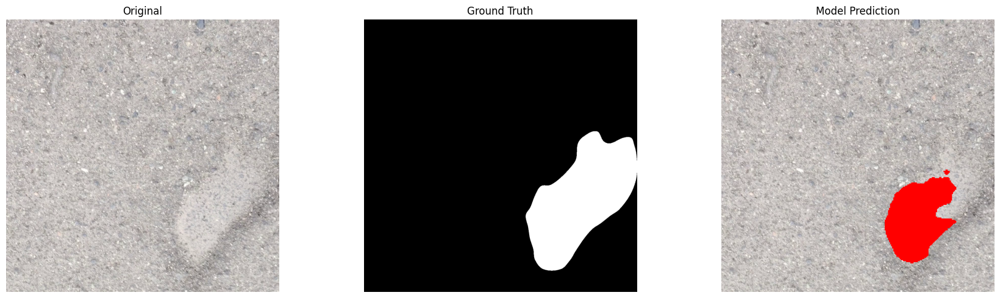

# Video-Based Pothole Segmentation using U-Net

## Overview

This project detects and segments potholes from road videos using a U-Net deep learning model. The system processes video frames to identify pothole locations, applies temporal processing to remove false detections, and estimates severity levels.

## What This Project Does

- Segments potholes at pixel level in video frames
- Reduces flickering by averaging predictions across frames
- Filters false positives by requiring consistent detections
- Estimates pothole severity for each video
- Evaluates results using standard metrics (Dice and IoU)  

## Problem

Potholes are a major issue for road infrastructure. Manual inspection is slow and inconsistent. We need an automated system that can:

- Detect potholes in road videos automatically
- Create pixel-level segmentation masks
- Reduce false alarms using temporal information
- Estimate the severity of damage for maintenance prioritization

## How It Works

### Dataset Preparation

The dataset consists of synchronized RGB videos and mask videos. 

Process:
- Extract frames from videos (every 3rd frame)
- Split into train, validation, and test sets
- Convert mask videos to binary images
- Organize by split and data type

### Preprocessing

Images are processed as follows:

- Resize to 256x256 pixels
- Normalize pixel values between 0 and 1
- Convert masks to binary format (0 or 1)

During training, additional augmentations are applied:

- Horizontal flips (50% of the time)
- Rotation between -10 to +10 degrees
- Brightness adjustment between 0.8x and 1.2x

### Model Architecture

The model uses U-Net, an encoder-decoder architecture designed for segmentation:

Input -> Encoder (4 levels) -> Bottleneck -> Decoder (4 levels) -> Output

The encoder progressively downsamples the image while extracting features. The bottleneck captures the most important information. The decoder upsamples back to the original size while combining information from the encoder layers (skip connections). The final output is a single channel with values between 0 and 1, representing the probability of a pothole at each pixel.

### Loss Function

Two losses are combined during training:

1. Binary Cross Entropy - measures pixel-level classification accuracy
2. Dice Loss - measures overlap between predicted and ground truth masks

Using both helps handle the class imbalance (potholes occupy small regions) and improves convergence.

### Results

On test frames:

Dice Score: 0.6491
IoU Score: 0.5353

These scores show that the model correctly identifies pothole regions in individual frames.

When temporal processing is applied (smoothing + persistence), the scores decrease slightly:

Dice Score: 0.5103
IoU Score: 0.3874

This trade-off is intentional. The temporal processing removes false positives and creates stable detections in videos, even though individual frame accuracy decreases.

## Temporal Processing

The model predictions are processed in three stages to improve reliability in videos.

### Stage 1: Temporal Smoothing

Individual frame predictions can flicker between consecutive frames. To reduce this noise, predictions are averaged over the last 5 frames. This creates smoother detections while still preserving genuine potholes.

### Stage 2: Persistence Logic

Even after smoothing, some false detections may appear. The system only confirms a pothole detection if it appears in at least 3 consecutive frames AND covers a minimum area. This eliminates isolated noise while keeping real potholes.

### Stage 3: Severity Estimation

For each video, the system calculates:

- Number of frames with detected potholes
- Duration the pothole is visible (seconds)
- Average size of the detected area
- Peak size of the detected area

Based on average area coverage, severity is classified as Small (less than 3% of frame), Medium (3-10%), or Large (above 10%).

## Results Summary

Sample outputs are generated in three formats:

Baseline: Raw model predictions frame by frame
Smoothed: Temporal averaging applied
Persistent: Full pipeline with persistence filtering

See the outputs folder for video examples.

---

## Tools and Libraries

Python 3.8 or higher
PyTorch 2.0 - Deep learning framework
OpenCV 4.8 - Video and image processing
NumPy 1.24 - Numerical operations
Matplotlib 3.8 - Visualization

## Setup

Install required packages:

pip install -r requirements.txt

This requires Python 3.8 or higher. A GPU is optional but recommended for faster training.

## Running the Project

1. Install dependencies using pip install -r requirements.txt

2. Prepare your dataset in this structure:

pothole_dataset/
  pothole_video/
    train/
      rgb/
      mask/
    val/
      rgb/
      mask/
    test/
      rgb/
      mask/

3. Open the notebook and run cells in order

   Phase 1: Frame extraction from videos
   Phase 2: Dataset creation and loading
   Phase 3: Model training
   Phase 4: Model evaluation
   Phase 5-6: Video inference (baseline)
   Phase 7: Temporal smoothing
   Phase 8: Persistence-based filtering
   Phase 9: Severity estimation
   Phase 10: Final evaluation

4. Output videos and metrics are generated automatically

## Project Contents

README.md - This file
requirements.txt - Python dependencies
project.ipynb - Main notebook with all phases

images/
  architecture.png - U-Net diagram
  result_sample.png - Example segmentation

outputs/
  output_baseline.mp4 - Raw predictions
  output_smoothed.mp4 - With temporal smoothing
  output_persistant.mp4 - Final pipeline output

## Author

Yaswant Sai
B.Tech CSE | Deep Learning & Computer Vision Enthusiast
---
